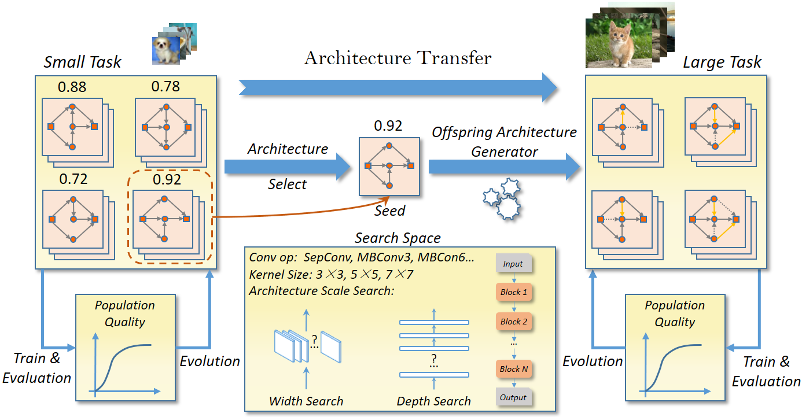
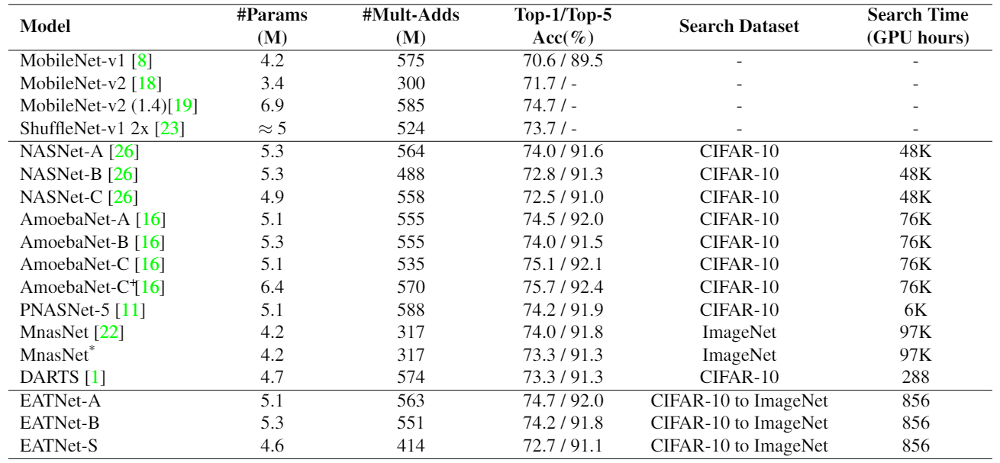

# EAT-NAS
The evaluation code of the paper [EAT-NAS: Elastic Architecture Transfer for Accelerating Large-scale Neural Architecture Search](https://arxiv.org/abs/1901.05884)

The framework of Elastic Architecture Transfer for Neural Architecture Search (EAT-NAS). We firstly search for the basic model on the small-scale task and then search on the large-scale task with the basic model as the initialization seed of the new population.

## Requirements
* mxnet 1.3.1
* python 2.7

Note: We test our code in the above environment.

## Results
Our results on ImageNet are displayed below.

To avoid any discrepancy between different implementations or training settings, we try our best to reproduce the performance of MnasNet (74.0\% on ImageNet). The highest accuracy we could reproduce is 73.3\% for MnasNet. All the training settings we use for our architectures are the same as that we reproduce MnasNet for the fair comparison.

Our pretrained models can be downloaded in the following:

* [EATNet-A](https://drive.google.com/open?id=1pbDfOzDWdhCpUQlD3SY2pojWUND6FMu4)
* [EATNet-B](https://drive.google.com/open?id=1ufVeJ1UggGgy3u68Ivmj3H254hHmgrT8)
* [EATNet-S](https://drive.google.com/open?id=1jUx6h-Pk4H2bFsVPlcBzILapusdZ1fha)

## Evaluate
1. Download the pretrained models and put them (.params and .json) into the `model_path`
2. `python eval.py --data_path 'The path to ImageNet data' --model_path 'The path you put the pretrained model'`